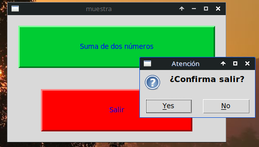
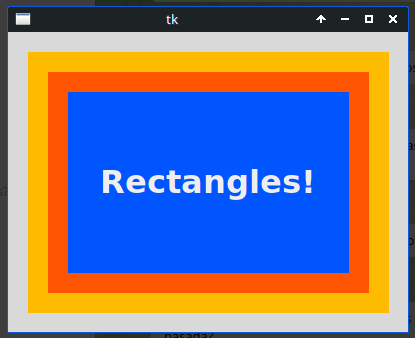
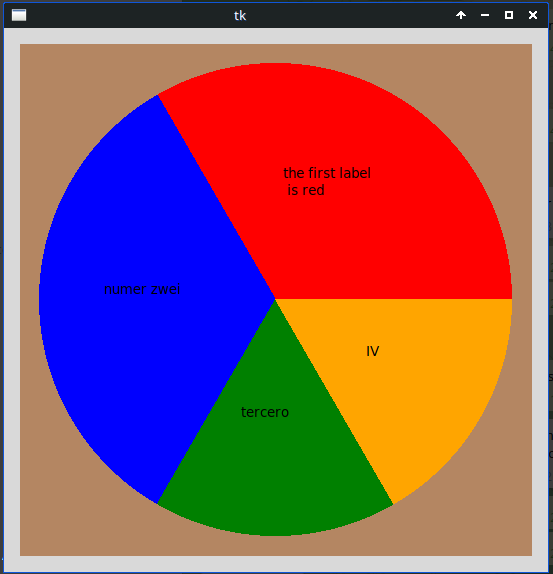
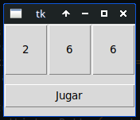
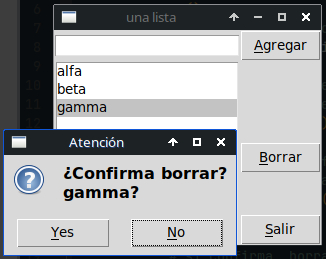
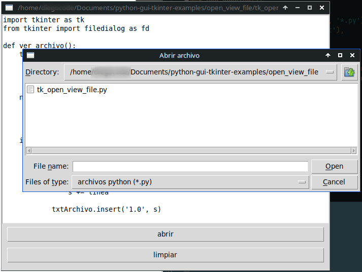
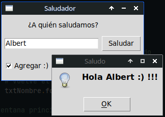
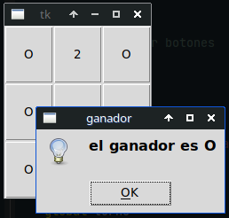
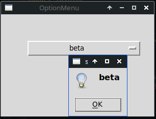
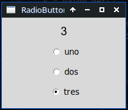

# tkinter examples

Examples using tkinter + python3. 

* botones_colores

	tk_botones_colores.py: Colours, decoration, hover effect, etc.  
	
  
  

* canvas

	* tk_canvas_rects.py
	
	
	* tk_canvas_pie_chart.py
	
	 	 
	* tk_canvas_images.py
	

  
    
* dados

	* tk_dados_text.py: Very simple game. Generate N random numbers between 1 and 6 each time the platyer press a button
	The number of numbers ("dices") can be changed with only one variable (CANT_DADOS)
	

  
    
* list

	* tk_list.py: Add and remove items from a ListBox. 
	MessageBox, focus, keyboard shortcuts.
	

  
    
* open_view_file
	
	tk_open_view_file.py: Lets you choose a text file (with askopenfilename) and presents it on a Text widget 
	

  
    
* saludador

	saludador.py: Basic application using Button, Label, Entry, Checkutton
	

  
    
* tic_tac_toe

	tictactoe.py: tic-tac-toe game
	
   
  
  
* widgets

	* tk_optionmenu.py: example with optionmenu widget
	
	
	* tk_radiobutton.py: example with radiobutton widget
	
	
